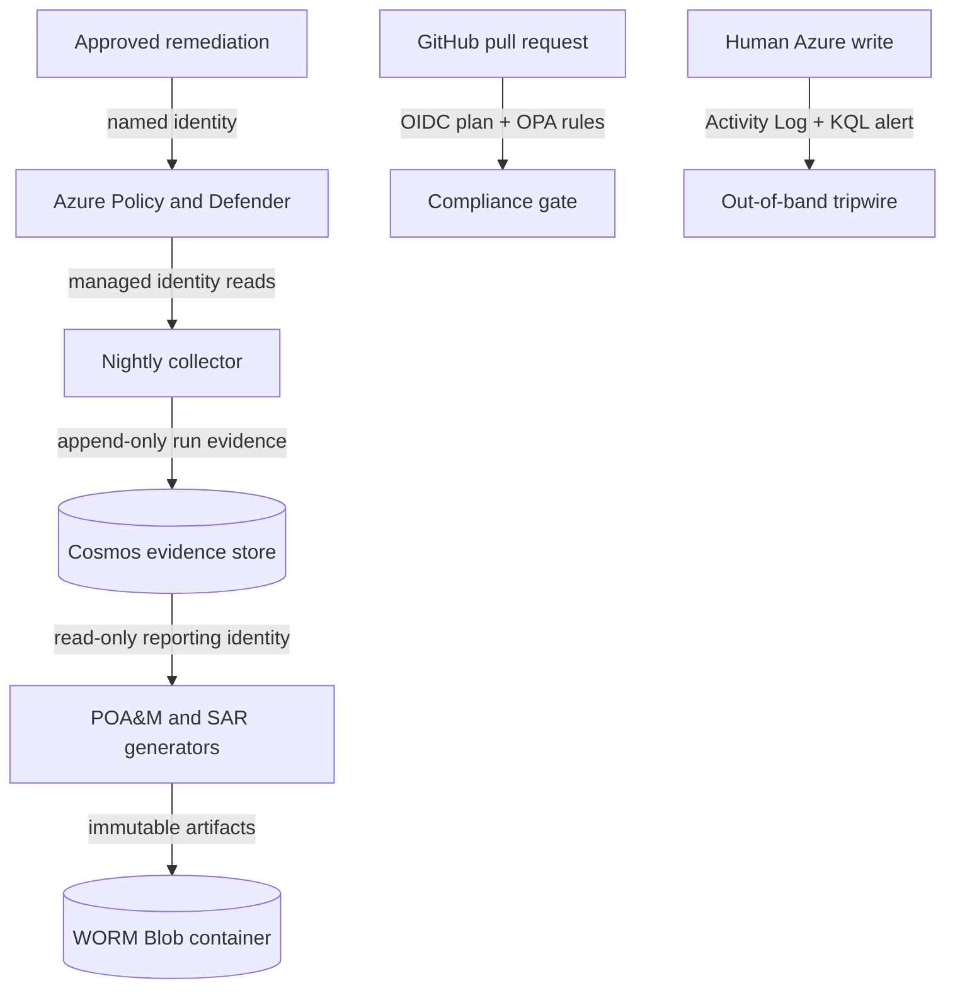

# CGE-AZ Capstone — John Flack

This repository implements a small Azure governance system whose purpose is not to
display cloud resources, but to produce defensible control evidence. It discovers
security posture, preserves each collection run, maps one body of evidence to
multiple frameworks, generates traceable reports, detects unreviewed change, and
remediates an approved class of failure through a named identity.

The project began from the GRC Engineering Club starter and has been materially
extended for this capstone. Candidate-authored work includes an owner-accountability
control (`CGE-AZ-JF-001`), historical assessment preservation, populated CSF/800-53
crosswalks, evidence-ledger hashes in reports, stored-evidence owner resolution, a
deployed human-change tripwire, complete Stage 02 CI/drift coverage, and a narrowed
GitHub OIDC plan role.

## Architecture

See [Architecture and trust boundaries](docs/ARCHITECTURE.md) for the data flow,
identity matrix, escalation ladder, and teardown boundary.

## Control objectives

| Objective | Implementation | Primary evidence |
|---|---|---|
| Prevent public evidence exposure | Deny policy plus OPA storage rules | Blocked Azure request and blocked PR |
| Establish accountability | Candidate control requires non-empty resource-group `owner` tags | Policy compliance state and stored owner |
| Preserve assessment history | Run-scoped document IDs; no cross-run upsert collision | Multiple Cosmos documents for the same assessment |
| Make reports reproducible | Reports pin a collection run and embed a source query and SHA-256 digest | POA&M JSON evidence ledger and SAR |
| Separate collection from narration | Collector writes evidence; reporter can only read Cosmos and write reports | Azure role assignments and managed identities |
| Detect unreviewed change | Nightly Terraform drift plus five-minute human-write log alert | Workflow history, issue, and Azure Monitor alert |
| Constrain automated correction | Audit → dry-run → enforce ladder using a named remediation identity | Reviewed diff, remediation task, and Activity Log caller |

Full mappings are in [Control mappings](docs/CONTROLS.md). Operational proof is
indexed in [Evidence register](docs/EVIDENCE.md).

## Deployment order

Each directory is an independent Terraform root with remote, versioned state:

1. `stages/01-foundation` — hierarchy, policies, identities, Activity Log, tripwire
2. `stages/02-activation` — discovery and bounded Defender/CSF activation
3. `stages/03-evidence-store` — Cosmos, collector, and WORM report storage
4. `stages/04-reporting` — separately identified POA&M and SAR generator
5. `stages/06-enforcement` — controlled remediation ladder

Stage 05 is intentionally absent. Generative narrative is not necessary to prove the
control loop, and the capstone keeps decision authority in deterministic controls.

## Assurance rules

- No passwords, access keys, or client secrets are committed. Azure workloads and
  GitHub Actions authenticate with managed identity or OIDC.
- Reports never query live control-plane state. They read a named collection run from
  Cosmos, making each number reproducible.
- Report blobs use time-based immutability. The policy remains unlocked in this
  disposable assessment subscription so the environment can be torn down; production
  would lock it only after retention and legal-hold requirements were approved.
- GitHub Actions can plan and inspect but cannot apply infrastructure or write RBAC.
- A `$10` monthly Azure budget alerts at 50%, 80%, and 100% forecast. Budgets are
  alerts, not spending caps; teardown remains the controlling safeguard.

## Validation status

The evidence register distinguishes implemented configuration from observed runtime
proof. A control is not marked proven until the corresponding Azure or GitHub artifact
has been captured. Run `./self-check.sh` before submission for the mechanical checks.

## Teardown

Destroy in reverse dependency order: `06 → 04 → 03 → 02 → 01`, turn both Defender
plans back to `Free`, remove the GitHub OIDC application, delete the state resource
group, and cancel the Azure subscription. The public repository and redacted evidence
remain as the assessment record.
